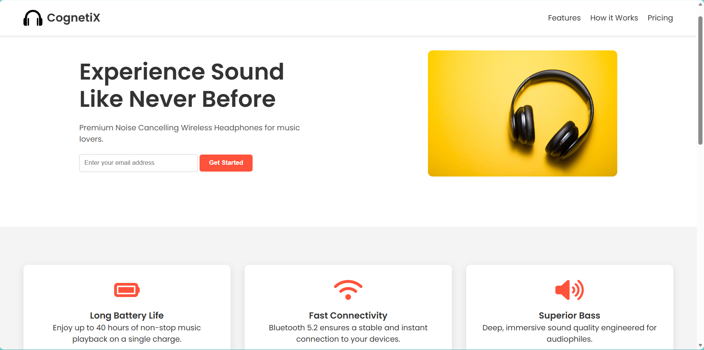
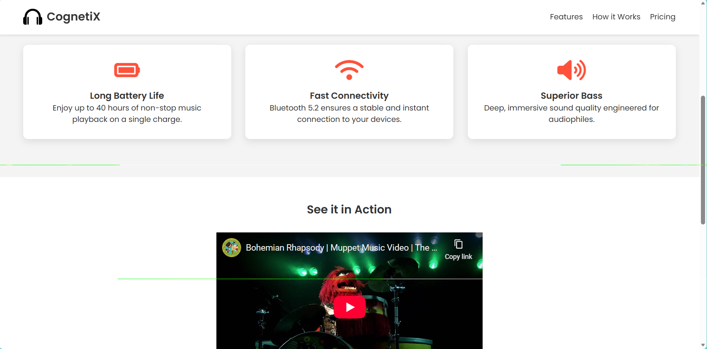
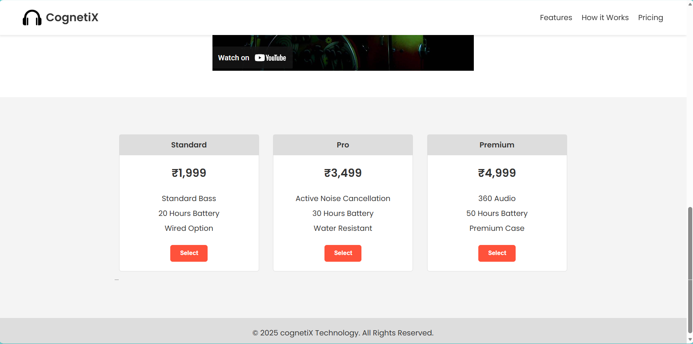

# Expense Tracker - Cognetix Technology Internship Task 2

This is a **Foundational Level Task** completed as part of the Full Stack Developer Internship at **Cognetix Technology**.

## 📌 Project Objective
Develop a full-stack expense tracker that allows users to record and manage income and expenses, view monthly summaries, and securely store data in LocalStorage.

## 🚀 Features
- **Add Transactions:** Users can add new income or expense details.
- **Track Balance:** Automatically calculates total balance, income, and expenses.
- **History Log:** Displays a list of past transactions.
- **Edit/Delete:** Options to modify or remove transactions.
- **Local Storage:** Data persists even after refreshing the page using browser LocalStorage.
- **Responsive Design:** Works smoothly on mobile and desktop devices.

## 🛠️ Technologies Used
- **HTML5:** For structure and layout.
- **CSS3:** For styling and responsive design.
- **JavaScript (ES6):** For logic, DOM manipulation, and LocalStorage handling.

## 📂 How to Run
1. Clone this repository or download the ZIP file.
2. Open the project folder.
3. Open the `index.html` file in any web browser (Chrome, Edge, Firefox).

## 📸 Screenshots

---
**Intern Name:** Ravi Kumar
**Internship Domain:** Full Stack Developer Intern
**Company:** Cognetix Technology